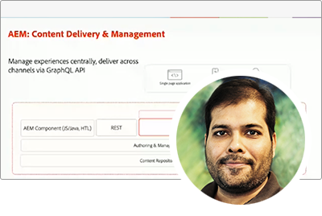
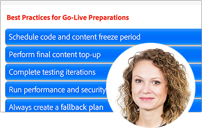

# Adobe Developers Live {#overview}

Adobe Developers Live führt Entwickler und Erlebnisentwickler mit unterschiedlichem Hintergrund und einem besonderen Zweck zusammen - um unglaubliche End-to-End-Erlebnisse zu schaffen. Diese zweitägige Konferenz wird wichtige Entwickleraktualisierungen, technische Sitzungen und Community-Netzwerkmöglichkeiten beinhalten.

Adobe-Produktteams in Adobe Experience Cloud, Document Cloud und Creative Cloud präsentieren die neuesten technologischen Fortschritte und Entwickler-Tools, die Design-, Content-Erstellungs-Workflows, Dokumentendienste und Customer Experience Management branchenübergreifend ermöglichen.

Für zukünftige Veranstaltungen registrieren **[here](https://developerevents.adobe.com/)**.

>[!TIP]
>
>**Alle aufgezeichneten Sitzungen werden in der Navigation auf der linken Seite aufgeführt**.

## Oktober 2021

Adobe-Produktteams in Adobe Experience Cloud, Document Cloud und Creative Cloud präsentierten die neuesten technologischen Fortschritte und Entwicklertools, die Design-, Content-Erstellungs-Workflows, Dokumentendienste und Customer Experience Management branchenübergreifend ermöglichen.

Sehen Sie sich die anderen [sessions](2021/october/overview.md) !

<table>
  <tr>
   <td>
      
      

         <a href="2021/october/headless.md"><strong>Headless-Sites</strong></a>         
          <em>mit Mathias Siegl, Principal Product Manager, AEM Sites</em>
      

      

         
         Mit GraphQL für Inhaltsfragmente, die für AEM 6.5 und Adobe Experience Manager as a Cloud Service verfügbar sind, sollten wir untersuchen, wie Adobe Experience Manager als Headless-CMS verwendet werden kann.
      

     </td>   
     <td>
      
      

         <a href="2021/october/aep-integration.md"><strong>Überblick über die Integration von Adobe Experience Platform</strong></a>
          <em>mit Eric Knee, Principal Enterprise Solution Architect</em>
      

      

         
         In dieser Sitzung erhalten Sie einen Überblick über verschiedene Möglichkeiten, wie Adobe Experience Platform in Ihr Ökosystem integriert werden kann, und über Aspekte, die bei der Planung der Integrationsarbeit zu beachten sind.
      

   </td>
   </td>
     <td>
      
      

         <a href="2021/october/pdf-services-api.md"><strong>Generieren von Dokumenten und Erfassen von E-Signaturen in Ihren Apps mithilfe der Adobe Sign API</strong></a>
          <em>mit Ben Vanderberg, Principal Developer Evangelist</em>
      

      

         
         Adobe Document Generation API ist ein leistungsstarker Dokumenterstellungs-Service, der von Microsoft Word-Vorlagen gesteuert wird, die mit Ihren Daten zusammengeführt wurden. In Kombination mit der Adobe Sign-API können Entwickler auf einfache Weise dynamische Dokumente erstellen, die über den Sign-Workflow verarbeitet werden können.
      

   </td> 
  </tr>
</table>

## Februar 2021

Auf dieser zweitägigen Konferenz wurden wichtige Adobe Experience Manager-Entwickleraktualisierungen vorgestellt, wie Headless und GraphQL, Adobe Experience Manager as a Cloud Service, technische Sitzungen und Community-Netzwerkmöglichkeiten.

Sehen Sie sich die anderen [sessions](2021/february/overview.md).

<table>
  <tr>
   <td>
      
      

         <a href="2021/february/headless-graphql-content-fragments.md"><strong>Headless - GraphQL mit Inhaltsfragmenten</strong></a>         
          <em>mit Jabran Asghar, Sr. Software Engineer</em>
      

      

         
         Erfahren Sie mehr über die neuen Headless-Funktionen mit den neuesten Inhaltsfragmentverbesserungen. Im Mittelpunkt dieser Sitzung steht die GraphQL-API für AEM Cloud Service.
      

     </td>   
     <td>
      
      

         <a href="2021/february/rapid-frontend-devlopment.md"><strong>Frontend Dev - Ihr zukünftiger Workflow zum schnellen Erstellen und Bereitstellen des Frontend Ihrer Site.</strong></a>
          <em>mit Gabriel Walt, Sr. Product Manager</em>
      

      

         
         Verwenden Sie Sitevorlagen, um in wenigen Klicks neue Sites zu erstellen und die Frontend-Entwicklung mit der schnellen Bereitstellung von Frontend-Assets wie CSS&amp;JS zu unterstützen.
      

   </td>
   </td>
     <td>
      
      

         <a href="2021/february/get-ready-aem-cloud.md"><strong>Vorbereitung auf den Cloud Service - Best Practices für die Migration</strong></a>
          <em>mit Andreea Moise, Sr. Software Engineer</em>
      

      

         
         Um die Vorteile von AEM Cloud Service optimal nutzen zu können, müssen Sie Ihre Codebasis so anpassen, dass sie Cloud-freundlich und kugelsicher ist und künftigen Upgrades im Rahmen des Programms standhält.
      

   </td>
  </tr>
</table>