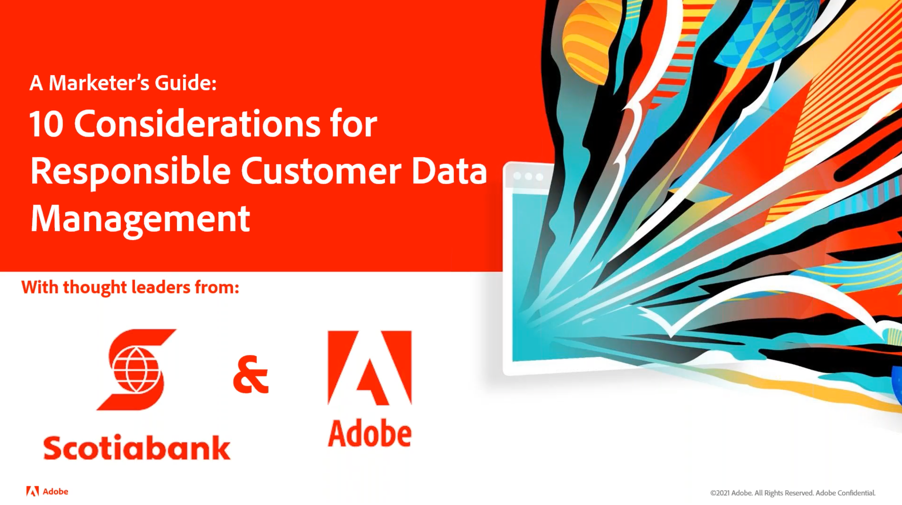
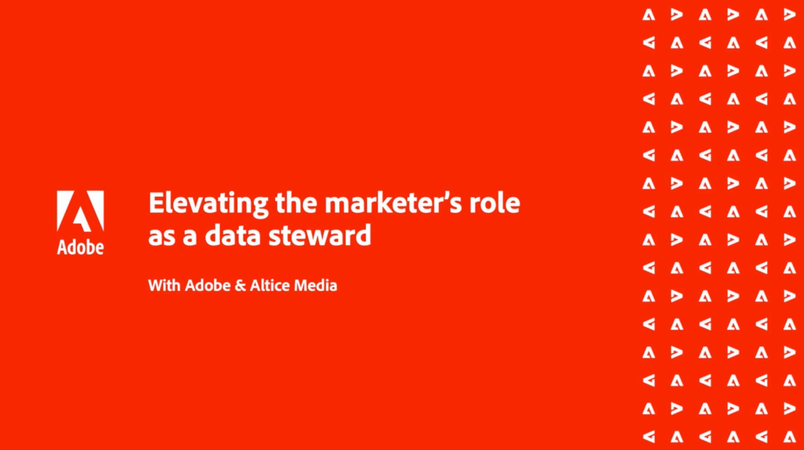

# Customer Data Management – Voices {#overview}

Willkommen beim Customer Data Management Voices Ihr Ziel als technisches und Marketing-Experten für das Kundendatenmanagement. Diese Seite ist Ihre zentrale Anlaufstelle, um von Ihren Kollegen zu hören, sich inspirieren zu lassen und über Entwicklungen im Bereich Martech zu erfahren. Keine Registrierung erforderlich, nur klicken und beobachten.

>[!TIP]
>
>**Alle aufgezeichneten Sitzungen werden in der Navigation auf der linken Seite aufgeführt**.

## Bausteine für das Kundendatenmanagement

<table>
  <tr>
   <td>
      
      

         <a href="./cdm/first-mile.md"><strong>Optimierung Ihrer ersten Rolle im Data Management</strong></a>
          
      

   </td>
   <td>
      
      

         <a href="./cdm/cdp-success.md"><strong>Auswählen einer Kundendatenplattform für Erfolg</strong></a>
          
      

    </td>
    <td>
      
      

         <a href="./cdm/people-and-process.md"><strong>Best Practices der CDP - Personen und Prozesse</strong></a>
          
      

    </td>
   </tr>
   <tr> 
   <td>
      
      

         <a href="./cdm/evolving-your-audience-center-of-excellence.md"><strong>Entwicklung Ihres Audience Center of Excellence</strong></a>
          
      

    </td>
   <td>
      
      

         <a href="./cdm/building-better-experiences-with-customer-profiles.md"><strong>Erstellen besserer Erlebnisse mit Kundenprofilen</strong></a>
      

      

         
    </td>
   <td>
      
      

         <a href="./cdm/how-marketing-teams-are-improving-data-management-strategies.md"><strong>Verbesserung von Data Management-Strategien durch Marketing-Teams</strong></a>
      

      

      

    </td>
  </tr>
</table>

## Zielgruppe und Profil - Data Governance und Datenschutz

<table>
  <tr>
   <td>
      
      

         <a href="./governance/healthcare-shield.md"><strong>Adobe Real-time Customer Data Platform und Gesundheitsschild</strong></a>
          
      

      

         
   </td> 
   <td>
      
      

         <a href="https://experienceleague.adobe.com/docs/platform-learn/tutorials/privacy/ten-considerations-for-responsible-customer-data-management.html"><strong>10 Überlegungen zum verantwortungsvollen Customer Data Management</strong></a>
          
      

      

         
    </td>
    <td>
      
      

         <a href="https://experienceleague.adobe.com/docs/platform-learn/tutorials/privacy/elevating-the-marketers-role-as-a-data-steward.html"><strong>Erhöhen der Rolle des Marketingexperten als Data Steward</strong></a>
          
      

      

         
       

    </td>
  </tr>
</table>

## Branchendiskussionen

<table>
  <tr>
     <td>
      
      

         <a href="./industry/build-superb-experiences-with-your-first-party-data.md"><strong>Erstellen hervorragender Erlebnisse mit Ihren Erstanbieterdaten</strong></a>
      

      

      

    </td>
     <td>
      
      

         <a href="./industry/data-collaboration-in-the-first-party-data-context.md"><strong>Datenerfassung im Erstanbieter-Datenkontext</strong></a>
      

      

      

    </td>
     <td>
      
      

         <a href="./industry/the-future-of-data-management-and-the-changing-environment.md"><strong>Die Zukunft des Daten-Managements und die sich verändernde Umgebung</strong></a>
      

      

      

    </td>
   <td>
      
      

         <a href="./industry/brands-vs-consumers.md"><strong>Eine Tabelle mit zwei Wahrnehmungen - Marken im Vergleich zu Verbrauchern</strong></a>
          
      

    </td>
  </tr>
</table>
