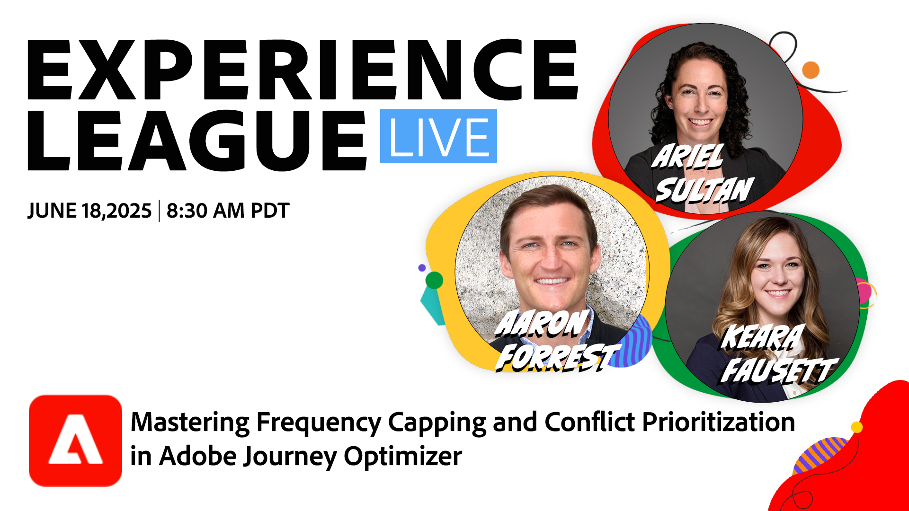

# Übergeordnete Frequenzlimitierung und Konfliktpriorisierung

In dieser Sitzung tauchen die Adobe-Experten Ariel Sultan, Aaron Forrest und Keara Fausett in neue Funktionen in Adobe Journey Optimizer ein, mit denen Sie Kundenbotschaften präzise steuern und priorisieren können. Erfahren Sie, wie Sie die Nachrichtenermüdung reduzieren, Konflikte lösen und wirkungsvolle Erlebnisse bereitstellen können, die Resonanz finden.

Diese Sitzung ist ideal für Marketing-Experten, Operations-Teams und Journey-Administratoren, die die Funktionen von Journey Optimizer für mehr Kontrolle und Effizienz beherrschen möchten.

Verpassen Sie nicht diese Gelegenheit, Ihre Marketing-Strategien zu transformieren und Ihre Zielgruppe wie nie zuvor zu interagieren.

**Klicken Sie auf das Bild unten, um eine YouTube-Erinnerung einzurichten!**

