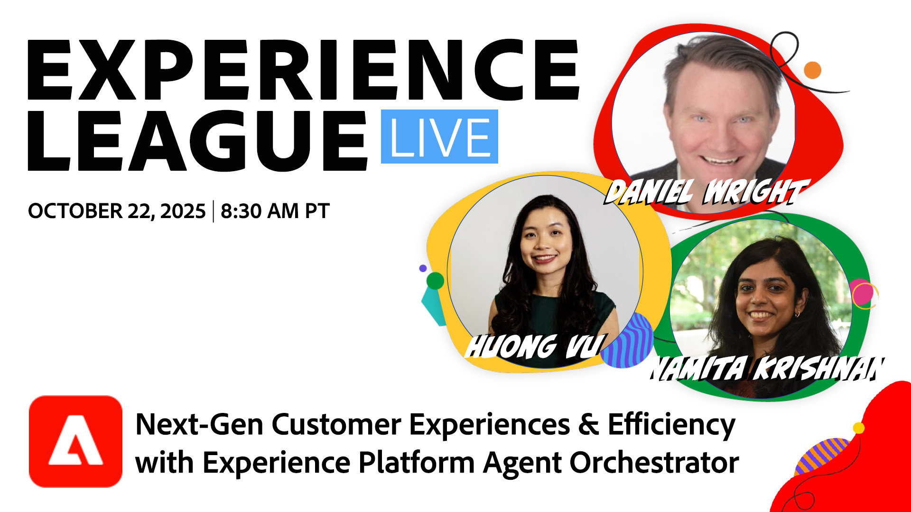

# Kundenerlebnisse der nächsten Generation und Effizienz mit Adobe Experience Platform Agent Orchestrator

Adobe Experience Platform Agent Orchestrator ist die neue agentische Schicht in Adobe Experience Platform. Experience Platform Agent Orchestrator wurde entwickelt, um die umfangreichen Daten und das Kundenwissen der Plattform zu nutzen. Es unterstützt die Intelligenz und das Denken der speziell entwickelten Adobe Experience Platform-Experten und ermöglicht es ihnen, komplexe Entscheidungsfindungs- und Problemlösungsaufgaben schnell und skaliert auszuführen - alles unter menschlicher Aufsicht. Über eine Gesprächsoberfläche wie den KI-Assistenten können Benutzer auf diese Agenten und andere KI-Komponenten zugreifen, um höhere Produktivitäts- und Effizienzgewinne zu erzielen.

> 

[Erinnerung für die Sendung festlegen!](https://youtube.com/live/WS_DzRmYNzw)
