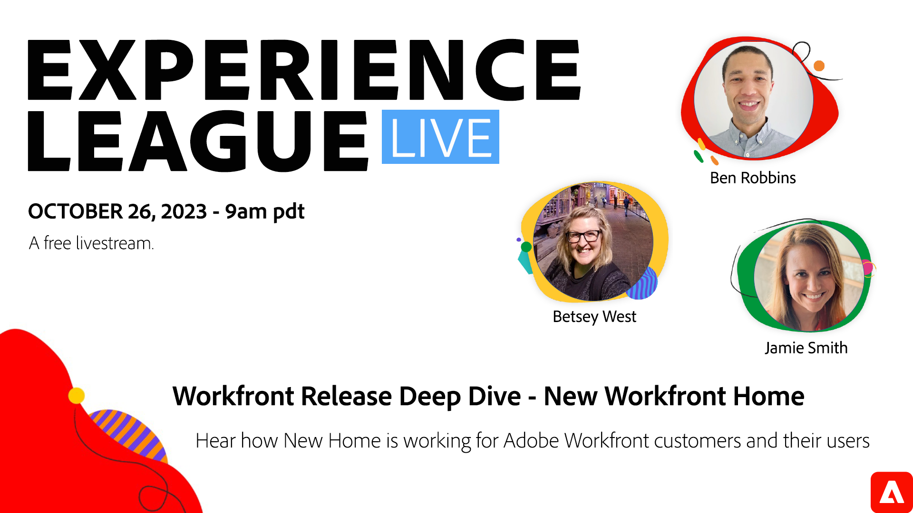

# Workfront Release Deep Dive - Neue Workfront-Homepage

Erfahren Sie von Workfront-Kunden, wie die neue Startseite für sie und ihre Benutzer funktioniert. Erfahren Sie mehr über die neuen Home-Funktionen, die im August bereitgestellt werden, und unsere neuen Admin-Layout-Steuerelemente. Finden Sie heraus, was 2024 als Nächstes zu Hause ist.

Die komplett überarbeitete Workfront-Startseite wurde zu einem Produktivitätsmotor. Mit den anpassbaren Widgets können Sie Ihren Workflow optimieren und nahtlos durch Projekte, Aufgaben, Probleme, Anforderungen und Erwähnungen navigieren, um sicherzustellen, dass nichts durch die Risse fällt. Dank der Flexibilität, die Startseite an Ihre individuellen Bedürfnisse anzupassen, können Sie Ihren eigenen zentralen Workfront-Hub erstellen.

In dieser Experience League Live Session führt Ihnen der Produktexperte Ben Robbins durch das neue Home-Erlebnis, einschließlich neuer Layoutsteuerungen für Administratoren und interessanter Verbesserungen aus dem Jahr 2024. Und Workfront-Kunde Jamie Smith wird Einblicke darüber geben, wie das neue Home-Erlebnis die Produktivität bei AT&amp;T steigert.

Wie immer können Sie in dieser Live-Sitzung Fragen im Chat stellen und Antworten von Experten erhalten.

**Klicken Sie auf das obige Bild, um eine Erinnerung festzulegen!**
