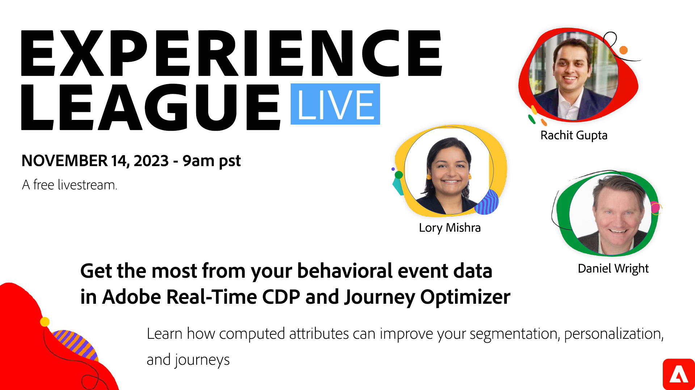

# Optimale Nutzung Ihrer verhaltensbezogenen Ereignisdaten in Real-Time CDP und Journey Optimizer

Erfahren Sie, wie Sie Aggregate von Ereignisdaten mit berechneten Attributen erstellen können, um Ihre Segmentierung, Personalisierung und Journey zu verbessern!

Verhaltensdaten sind eine wichtige Voraussetzung für die Bereitstellung personalisierter Kundenerlebnisse, können aber nur schwer vollständig genutzt werden. Heute können Sie sich möglicherweise auf separate Systeme, Techniker und Dateningenieure verlassen, um aussagekräftige Aggregate von Verhaltensdaten zu erstellen, um großartige Erlebnisse bereitzustellen.

In dieser Experience League-Live-Sitzung zeigen Ihnen Produktexperten, wie Sie mit &quot;berechneten Attributen&quot;in Real-Time CDP und Journey Optimizer mithilfe einer einfachen Benutzeroberfläche verhaltensbezogene Aggregate als Profilattribute erstellen können, die für eine verbesserte Segmentierung und Personalisierung verwendet werden können.

**Klicken Sie auf das obige Bild, um sich für das Livestream-Ereignis zu registrieren!**
