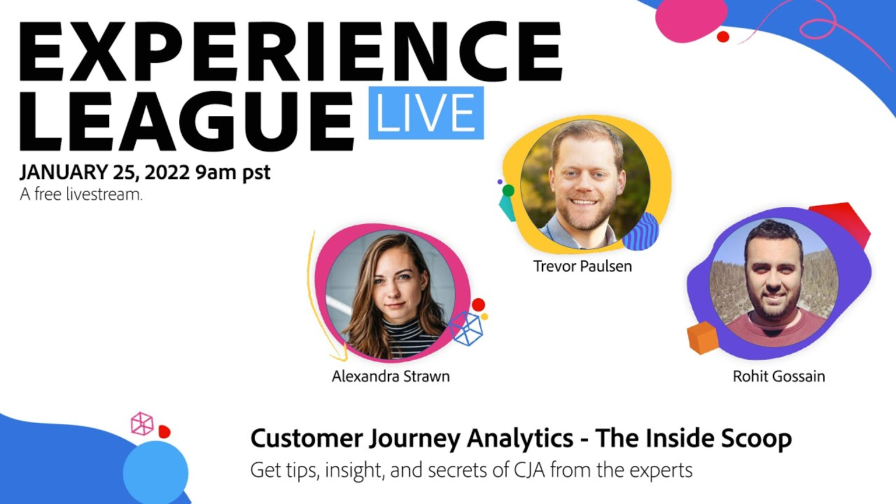

# Experience League LIVE 

Experience League LIVE ist eine vom Experience League-Team veranstaltete Live-Streaming-Show.  Dort haben Sie Gelegenheit, sich mit Produktexperten von Adobe auszutauschen und praktische Tipps, Tricks und Strategien für die Arbeit mit den Anwendungen rund um Adobe Experience Cloud zu erlernen.

## Bevorstehende Experience League LIVE-Ereignisse

<table>
<tr>
  <td>
    Kommen Sie bald zurück und erfahren Sie mehr über unsere bevorstehende Ausstellung im April 2024. 
    In der Zwischenzeit werden wir dich im <a href="https://summit.adobe.com/na/">Adobe Summit</a> am 25.-28. März 2024!

</td>
</tr>
</table>

## Favoriten unserer Mitarbeiter

<table style="max-width: 1214px;">

<tr>
  <td style="vertical-align: top;">
    

      <a href="/help/experience-league-live/episodes/exl-live-episode-04-21-22.md">
        <strong>AEM von Headful zu Headless</strong>
      </a>
       <em>mit Danny Gordon, Amol Anand, Sachin Mali und Sean Steimer</em>
       <em>21. April 2022</em>
    

  </td>

<td style="vertical-align: top;">
    
    

      <a href="episodes/exl-live-episode-08.md"><strong>Customer Journey Analytics - Die interne Scoop</strong></a>
       <em>mit Trevor Paulsen, Rohit Gossain, Alex Strawn</em>
       <em>25. Januar 2021</em>
    

  </td>

<td style="vertical-align: top;">
    
    

      <a href="episodes/exl-live-episode-05-26-22.md">
        <strong>Fragen Sie die Experten: Die Grundlagen des Web SDK</strong>
      </a>
       <em>mit Rudi Shumpert, Jeff Chasin und Eric Matisoff</em>
       <em>26. Mai 2022</em>
    

  </td>
  </tr>

</table>

>[!TIP]
>
>Weitere Lernmöglichkeiten finden Sie in unseren kostenlosen [Kursen](https://experienceleague.adobe.com/?lang=de#dashboard/learning) sowie in den einzelnen [Tutorials](https://experienceleague.adobe.com/docs/home-tutorials.html?lang=de).
