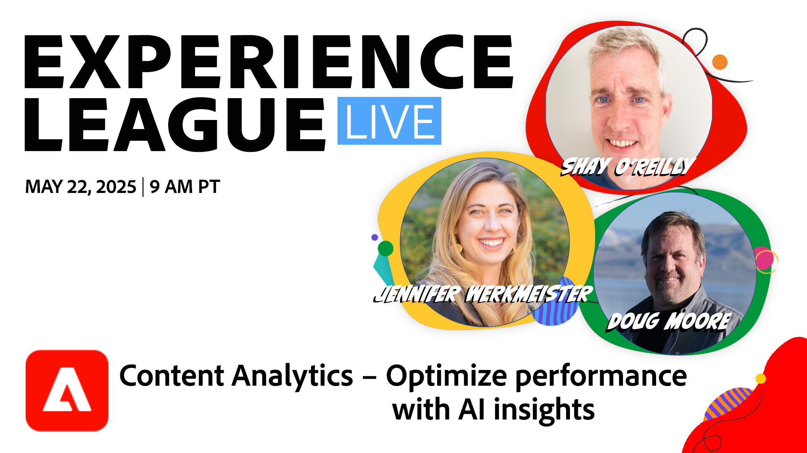

# Experience League LIVE 

Experience League LIVE ist eine vom Experience League-Team veranstaltete Live-Streaming-Show.  Dort haben Sie Gelegenheit, sich mit Produktexperten von Adobe auszutauschen und praktische Tipps, Tricks und Strategien für die Arbeit mit den Programmen rund um Adobe Experience Cloud kennenzulernen.

## Bevorstehende Experience League LIVE-Events

<table>
    <tr>
        <td style="vertical-align: top;">
            

              <a href="episodes/exl-live-episode-05-22-25.md">
                <strong>Content Analytics: Optimieren Sie die Leistung mit KI-Einblicken</strong>
              </a>
               <em>mit Shay O'Reilly, Jennifer Werkmeister und Doug Moore</em>
               <em>22. Mai 2025</em>
            

        </td>
    </tr>
    <tr>
        <td style="vertical-align: top;">
            

              <a href="episodes/exl-live-episode-47-2025-06-05.md">
                <strong>Agile Workflows für personalisierte Inhalte in großem Maßstab</strong>
              </a>
               <em>mit Amarnath Vannarath, Chris Ivory und Rohan Bhatt</em>
               <em>5. Juni 2025</em>
            

        </td>
    </tr>
</table>

## Favoriten unserer Mitarbeiter

<table style="max-width: 1214px;">

<tr>
  <td style="vertical-align: top;">
    

      <a href="episodes/exl-live-episode-06-26-24.md">
        <strong>Wie die neuesten Adobe Real-Time CDP-Versionen die Nadel für Ihr Unternehmen verschieben können</strong>
      </a>
       <em>mit Nina Caruso, Rudi Shumpert und Doug Moore</em>
       <em>26. Juni 2024</em>
    

  </td>

<td style="vertical-align: top;">
    
    

      <a href="episodes/exl-live-episode-05-16-24.md"><strong>So migrieren Sie Analytics zu Web SDK</strong></a>
       <em>mit Mitch Rice, Joe Khoury und Doug Moore</em>
       <em>16. Mai 2024</em>
    

  </td>

<td style="vertical-align: top;">
    
    

      <a href="episodes/exl-live-episode-04-24-24.md">
        <strong>Neuer Code-basierter Erlebniskanal in Journey Optimizer</strong>
      </a>
       <em>mit Sandra Hausmann, Robert Calangiu und Brent Kostak</em>
       <em>24. April 2024</em>
    

  </td>
  </tr>

</table>

>[!TIP]
>
>Weitere Lernmöglichkeiten finden Sie in unseren kostenlosen [Kursen](https://experienceleague.adobe.com/?lang=de#dashboard/learning) sowie in einzelnen [Tutorials](https://experienceleague.adobe.com/docs/home-tutorials.html?lang=de).

