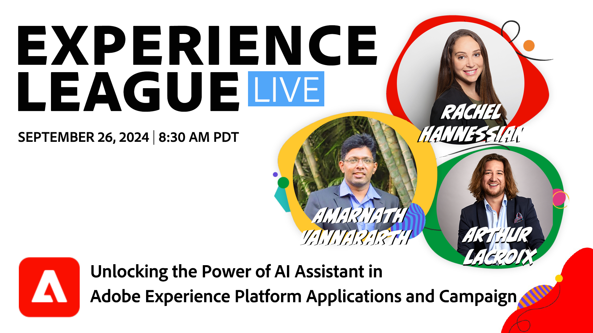

# Experience League LIVE 

Experience League LIVE ist eine Live-Streaming-Show des Experience League-Teams.  Sie können sich mit Adobe-Produktexperten verbinden und praktische Tipps, Tricks und Strategien lernen, die Sie mit den Adobe Experience Cloud-Anwendungen anwenden können.

## Bevorstehende Experience League LIVE-Ereignisse

<table>
<tr>

<td style="vertical-align: top;">
    

      <a href="episodes/exl-live-episode-09-18-24.md">
        <strong>Sind Sie bereit, Ihre mobile Analytics-App zu optimieren?</strong>
      </a>
       <em>mit Daniel Wright, Mitch Rice und Kevin Lind</em>
       <em>18. September 2024 um 8:30 PT</em>
    

  </td>
</tr>
</table>
<table>
<tr>

<td style="vertical-align: top;">
    

      <a href="episodes/exl-live-episode-09-18-24.md">
        <strong>Erfahren Sie, wie der KI-Assistent Kundeninteraktionen transformiert und die Produktivität in Adobe Experience Cloud-Anwendungen und Adobe Campaign erhöht. </strong>
      </a>
       <em>mit Rachel Hannessian, Amarnath Vannararth und Arthur Lacroix</em>
       <em>26. September 2024 um 8:30 PT</em>
    

  </td>
</tr>
</table>

## Favoriten unserer Mitarbeiter

<table style="max-width: 1214px;">

<tr>
  <td style="vertical-align: top;">
    

      <a href="episodes/exl-live-episode-06-26-24.md">
        <strong>Wie die neuesten Adobe Real-Time CDP-Versionen die Nadel für Ihr Unternehmen bewegen können</strong>
      </a>
       <em>mit Nina Caruso, Rudi Shumpert und Doug Moore</em>
       <em>26. Juni 2024</em>
    

  </td>

<td style="vertical-align: top;">
    
    

      <a href="episodes/exl-live-episode-05-16-24.md"><strong>So migrieren Sie Analytics auf Web SDK</strong></a>
       <em>mit Mitch Rice, Joe Khoury und Doug Moore</em>
       <em>16. Mai 2024</em>
    

  </td>

<td style="vertical-align: top;">
    
    

      <a href="episodes/exl-live-episode-04-24-24.md">
        <strong> Neuer code-basierter Erlebniskanal in Journey Optimizer</strong>
      </a>
       <em>mit Sandra Hausmann, Robert Calangiu und Brent Kostak</em>
       <em>24. April 2024</em>
    

  </td>
  </tr>

</table>

>[!TIP]
>
>Weitere Lernmethoden finden Sie in unseren kostenlosen [Kursen](https://experienceleague.adobe.com/?lang=de#dashboard/learning) sowie einzelnen [Tutorials](https://experienceleague.adobe.com/docs/home-tutorials.html?lang=de).
