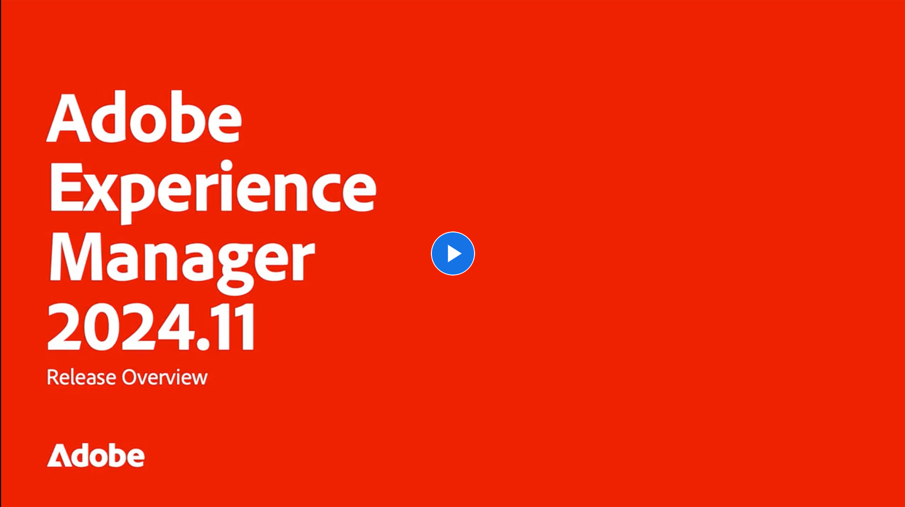

# Adobe Experience Manager as a Cloud Service-Versionshinweise

Verschaffen Sie sich einen schnellen Überblick über die neuesten Funktionen in Adobe Experience Manager as a Cloud Service. Dies sind kurze, etwa 10-minütige Videos, die vom AEM Produktteam bereitgestellt werden und die Highlights der neuesten Version teilen.

## Neueste Aktualisierung

<!-- CARDS

{cta = More details}

* 2024/2024-11-0.md

-->
<!-- START CARDS HTML - DO NOT MODIFY BY HAND -->

    

        

            

                <figure class="image x-is-16by9">
                    
                </figure>
            

            

                

                    

                        <a href="2024/2024-11-0.md" target="_blank" rel="referrer" title="Übersicht über die AEM 2024.11.0">Übersicht über die AEM für 2024.11.0</a>
                    

                    
Diese Version enthält wichtige Aktualisierungen für Adobe Experience Manager (AEM) Sites und Assets, einschließlich verbesserter Erweiterbarkeit der Benutzeroberfläche, neuer Ausgabedarstellungsoptionen, erweiterter Bildmodifikatoren und Verbesserungen für Edge Delivery Services mit dem universellen Editor in AEM.

                

                <a href="2024/2024-11-0.md" target="_blank" rel="referrer" class="spectrum-Button spectrum-Button--outline spectrum-Button--primary spectrum-Button--sizeM" style="align-self: flex-start; margin-top: 1rem;">
                    Weitere Details
                </a>
            

        

    

<!-- END CARDS HTML - DO NOT MODIFY BY HAND -->

## Frühere Updates

<!-- CARDS
{cta = More details}

  * 2024/2024-10-0.md
  * 2024/2024-9-0.md
  * 2024/2024-8-0.md
  * 2024/2024-7-0.md
  * 2024/2024-6-0.md
  * 2024/2024-5-0.md
  * 2024/2024-4-0.md
  * 2024/2024-3-0.md
  * 2024/2024-1-0.md
  
-->
<!-- START CARDS HTML - DO NOT MODIFY BY HAND -->

    

        

            

                <figure class="image x-is-16by9">
                    
                </figure>
            

            

                

                    

                        <a href="2024/2024-10-0.md" target="_blank" rel="referrer" title="Übersicht über die AEM 2024.10.0">Übersicht über die AEM für 2024.10.0</a>
                    

                    
Die Funktionen in dieser Version konzentrieren sich auf Experience Manager Assets- und Cloud Service-Innovationen und beinhalten Folgendes:AEM Assets Neue Preise und Verpackung für AEM Assets mit Assets Ultimate und Asset PrimeAEM Cloud Service Weiterleiten von Protokollen an weitere Ziele Pipeline-freie URL-Weiterleitungen für Geschäftsbenutzer ​ RDEs Unterstützung Config Pipeline YAMLs ​ interaktive AEM Developer Console

                

                <a href="2024/2024-10-0.md" target="_blank" rel="referrer" class="spectrum-Button spectrum-Button--outline spectrum-Button--primary spectrum-Button--sizeM" style="align-self: flex-start; margin-top: 1rem;">
                    Weitere Details
                </a>
            

        

    

    

        

            

                <figure class="image x-is-16by9">
                    
                </figure>
            

            

                

                    

                        <a href="2024/2024-9-0.md" target="_blank" rel="referrer" title="Übersicht über die AEM 2024.9.0">Versionsübersicht 2024.9.0 AEM</a>
                    

                    
Die Funktionen in dieser Version konzentrieren sich auf Experience Manager Assets- und Cloud Service-Innovationen und umfassen Folgendes: AEM Assets - Verbesserung der Asset-Auswahl zur Unterstützung von Sammlungen ​ Assets Content Hub - Unterstützung von DRM (abgelaufene und lizenzierte Assets) ​ AEM Cloud Service - Cloud Manager-Unterstützung für Edge Delivery ​ Side Includes (ESI) ​ Basic Authentication ​ Interactive AEM

                

                <a href="2024/2024-9-0.md" target="_blank" rel="referrer" class="spectrum-Button spectrum-Button--outline spectrum-Button--primary spectrum-Button--sizeM" style="align-self: flex-start; margin-top: 1rem;">
                    Weitere Details
                </a>
            

        

    

    

        

            

                <figure class="image x-is-16by9">
                    
                </figure>
            

            

                

                    

                        <a href="2024/2024-8-0.md" target="_blank" rel="referrer" title="Übersicht über die AEM 2024.8.0">Versionsübersicht 2024.8.0 AEM</a>
                    

                    
Die Funktionen in dieser Version konzentrieren sich auf AEM Assets &amp; Dynamic Media, Forms, Sites und Cloud Foundation-Innovationen und umfassen die folgenden Dynamic Media Composable Templates für 1:1-dynamische Varianten Forms GenAI Assistant Universal Editor mit neuer AEM Inhaltsstrukturintegration ​ Verwalten des Lebenszyklus von DV-Zertifikaten und der Unterstützung für Edge Delivery Services über Cloud Manager Experience Audit Dashboard-Verbesserungen der Pipeline-Leistung

                

                <a href="2024/2024-8-0.md" target="_blank" rel="referrer" class="spectrum-Button spectrum-Button--outline spectrum-Button--primary spectrum-Button--sizeM" style="align-self: flex-start; margin-top: 1rem;">
                    Weitere Details
                </a>
            

        

    

    

        

            

                <figure class="image x-is-16by9">
                    
                </figure>
            

            

                

                    

                        <a href="2024/2024-7-0.md" target="_blank" rel="referrer" title="Übersicht über die AEM 2024.7.0">Versionsübersicht 2024.7.0 AEM</a>
                    

                    
Die Funktionen in dieser Version konzentrieren sich auf Experience Manager Assets- und Cloud Service-Innovationen und umfassen folgende:AEM Assets:Content Credentials in AEM Assets ​ AI-gestützte Untertitel für Videos mit Dynamic Media ​ Asset Selector-Verbesserungen für das Hochladen ​ Cloud Manager:Self-Service-Konfiguration von kundenverwalteten CDN-Anmeldeinformationen ​ CDN-Bereinigung ​ Traffic-Filterregeln Warnhinweise ​

                

                <a href="2024/2024-7-0.md" target="_blank" rel="referrer" class="spectrum-Button spectrum-Button--outline spectrum-Button--primary spectrum-Button--sizeM" style="align-self: flex-start; margin-top: 1rem;">
                    Weitere Details
                </a>
            

        

    

    

        

            

                <figure class="image x-is-16by9">
                    
                </figure>
            

            

                

                    

                        <a href="2024/2024-6-0.md" target="_blank" rel="referrer" title="Übersicht über AEM Version 2024.6.0">Überblick über die AEM für 2024.6.0</a>
                    

                    
Die Funktionen in der Version vom Juni 2024 betreffen AEM Assets mit Content Hub, Dynamic Media mit OpenAPI-Funktionen, Assets-Selektor-Verbesserungen - Tags und abgelaufene Assets, Inhaltsfragmentmodelle in der Inhaltsfragment-Admin Console, Cloud Foundation - Hinzufügen privater Repositorys in Cloud Manager und Cloud Foundation - Inhaltswiederherstellung.

                

                <a href="2024/2024-6-0.md" target="_blank" rel="referrer" class="spectrum-Button spectrum-Button--outline spectrum-Button--primary spectrum-Button--sizeM" style="align-self: flex-start; margin-top: 1rem;">
                    Weitere Details
                </a>
            

        

    

    

        

            

                <figure class="image x-is-16by9">
                    
                </figure>
            

            

                

                    

                        <a href="2024/2024-5-0.md" target="_blank" rel="referrer" title="Übersicht über die AEM 2024.5.0">Versionsübersicht 2024.5.0 AEM</a>
                    

                    
Die Funktionen in dieser Version konzentrieren sich auf - Neue Publish-Optionen für AEM und Dynamic Media Universal Editor Verbesserungen Migration von adaptiven Forms Foundation-Komponenten zu Kernkomponenten Zusätzliche Captcha-Unterstützung in den Verbesserungen der adaptiven Forms Cloud Foundation

                

                <a href="2024/2024-5-0.md" target="_blank" rel="referrer" class="spectrum-Button spectrum-Button--outline spectrum-Button--primary spectrum-Button--sizeM" style="align-self: flex-start; margin-top: 1rem;">
                    Weitere Details
                </a>
            

        

    

    

        

            

                <figure class="image x-is-16by9">
                    
                </figure>
            

            

                

                    

                        <a href="2024/2024-4-0.md" target="_blank" rel="referrer" title="Übersicht über die AEM 2024.4.0">Versionsübersicht 2024.4.0 AEM</a>
                    

                    
Die Funktionen in dieser Version konzentrieren sich auf Experience Manager Assets- und Cloud Service-Innovationen und beinhalten folgende:AEM Assets:1-Klick-Asset-/Ordnernamen in Assets-AnsichtVereinfachtes Sucherlebnis mit natürlicher SpracheVorschau dynamischer Ausgabeformate einschließlich smartes Zuschneiden von Assets-Ansichten Bearbeitungsvideos einfach in AEM mit Express Quick ActionsCloud Manager:CDN-Optimierungen und Optimierung der Self-Service-Konfiguration von Versionsbereinigungs- und Wartungsaufgaben für Prüfprotokolle Vorteile über Splunk hinaus mit Self-Service, dedizierter IP-UnterstützungCDN-Unterstützung für ESI, auch über SDIIverbessertes Java-Protokollierungserlebnis für RDE

                

                <a href="2024/2024-4-0.md" target="_blank" rel="referrer" class="spectrum-Button spectrum-Button--outline spectrum-Button--primary spectrum-Button--sizeM" style="align-self: flex-start; margin-top: 1rem;">
                    Weitere Details
                </a>
            

        

    

    

        

            

                <figure class="image x-is-16by9">
                    
                </figure>
            

            

                

                    

                        <a href="2024/2024-3-0.md" target="_blank" rel="referrer" title="Übersicht über die AEM 2024.3.0">Versionsübersicht 2024.3.0 AEM</a>
                    

                    
Hohe Auswirkungen AEM Authoring mit Edge Delivery Services-Edge Delivery Services für FormsContent für alle, für alle universellen Editor Actionable Intelligence AEM Sites - Generate Content Variations (GenAI)Rapid Development CruD OpenAPIs for Content Fragments and ModelsCloud Service Foundation Advanced NetworkingWeitere wichtige Verbesserungen Vergleichen Inhaltsfragmentversionen Multisite-Verwaltungsunterstützung für Experience Fragments Update Content Importer v1.5 1.0 Sidekick Extension v6.41.0

                

                <a href="2024/2024-3-0.md" target="_blank" rel="referrer" class="spectrum-Button spectrum-Button--outline spectrum-Button--primary spectrum-Button--sizeM" style="align-self: flex-start; margin-top: 1rem;">
                    Weitere Details
                </a>
            

        

    

    

        

            

                <figure class="image x-is-16by9">
                    
                </figure>
            

            

                

                    

                        <a href="2024/2024-1-0.md" target="_blank" rel="referrer" title="Übersicht über die AEM 2024.1.0">Versionsübersicht 2024.1.0 AEM</a>
                    

                    
Die Funktionen in dieser Version konzentrieren sich auf Experience Manager Assets- und Cloud Service-Innovationen und umfassen die folgenden Funktionen: AEM Assets - AEM Assets Cloud Service- und Adobe Journey Optimizer-Integration, Smart-Tags-Blockierungsliste, OOTB-Videovorschau-Wiedergabe, Cloud Manager - Benutzerdefinierte Berechtigungen

                

                <a href="2024/2024-1-0.md" target="_blank" rel="referrer" class="spectrum-Button spectrum-Button--outline spectrum-Button--primary spectrum-Button--sizeM" style="align-self: flex-start; margin-top: 1rem;">
                    Weitere Details
                </a>
            

        

    

<!-- END CARDS HTML - DO NOT MODIFY BY HAND -->
