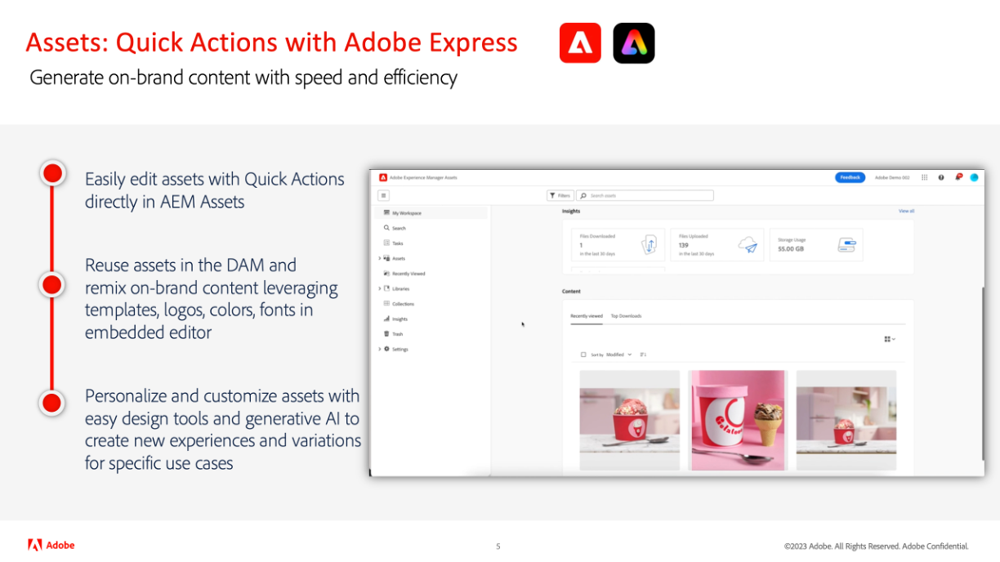

# Aktualisierungen zu Adobe Experience Manager as a Cloud Service-Versionen

Verschaffen Sie sich einen schnellen Überblick über die neuesten Funktionen in Adobe Experience Manager as a Cloud Service. Dies sind kurze, etwa 10-minütige Videos, die vom AEM-Produkt-Team bereitgestellt werden und über die Highlights der neuesten Version informieren.

## Neueste Aktualisierung

<table style="max-width: 50%;">
  <tr>
    <td>
      
      

        <a href="2024/2024-4-0.md">
          <strong>Version | 2024.4.0</strong>
        </a>
      

      
<em>Veröffentlichungsdatum Mai 2024 </em>

      

        <a href="https://experienceleague.adobe.com/docs/experience-manager-cloud-service/content/release-notes/release-notes/release-notes-current.html?lang=de">Versionshinweise</a>
      

    </td>
  </tr>  
</table>

## Frühere Updates

<table style="max-width: 50%;">
  <tr>
    <td>
      
      

        <a href="2024/2024-3-0.md">
          <strong>Version | 2024.3.0</strong>
        </a>
      

      
<em>Veröffentlichungsdatum April 2024 </em>

      

        <a href="https://experienceleague.adobe.com/docs/experience-manager-cloud-service/content/release-notes/release-notes/release-notes-current.html?lang=de">Versionshinweise</a>
      

    </td>
    <td>
      
      

        <a href="2024/2024-1-0.md">
          <strong>Version | 2024.1.0</strong>
           
        </a>
          <em>Veröffentlichungsdatum Januar 2024 </em>
      

      

        <a href="https://experienceleague.adobe.com/docs/experience-manager-cloud-service/content/release-notes/release-notes/release-notes-current.html?lang=de">Versionshinweise</a>
      

    </td>
    <td>
      
      

        <a href="2023/2023-11-0.md">
          <strong>Version | 2023.11.0</strong>
           
        </a>
          <em>Releasedatum November 2023 </em>
      

      

        <a href="https://experienceleague.adobe.com/docs/experience-manager-cloud-service/content/release-notes/release-notes/release-notes-current.html?lang=de">Versionshinweise</a>
      

    </td>
  </tr>
  <tr>
    <td>
      
      

        <a href="2023/2023-10-0.md">
          <strong>Version | 2023.10.0</strong>
           
        </a>
          <em>Veröffentlichungsdatum Oktober 2023 </em>
      

      

        <a href="https://experienceleague.adobe.com/docs/experience-manager-cloud-service/content/release-notes/release-notes/release-notes-current.html?lang=de">Versionshinweise</a>
      

    </td>
    <td>
      
      

        <a href="2023/2023-9-0.md">
          <strong>Version | 2023.9.0</strong>
           
        </a>
          <em>Veröffentlichungsdatum September 2023 </em>
      

      

        <a href="https://experienceleague.adobe.com/docs/experience-manager-cloud-service/content/release-notes/release-notes/release-notes-current.html?lang=de">Versionshinweise</a>
      

    </td> 
    <td>
      
      

        <a href="2023/2023-8-0.md">
          <strong>Version | 2023.8.0</strong>
           
        </a>
          <em>Veröffentlichungsdatum August 2023 </em>
      

      

        <a href="https://experienceleague.adobe.com/docs/experience-manager-cloud-service/content/release-notes/release-notes/release-notes-current.html?lang=de">Versionshinweise</a>
      

    </td>
  </tr>
  <tr>    
    <td>
      
      

        <a href="2023/2023-7-0.md">
          <strong>Version | 2023.7.0</strong>
           
        </a>
          <em>Veröffentlichungsdatum Juli 2023 </em>
      

      

        <a href="https://experienceleague.adobe.com/docs/experience-manager-cloud-service/content/release-notes/release-notes/release-notes-current.html?lang=de">Versionshinweise</a>
      

    </td>
    <td>
      
      

        <a href="2023/2023-6-0.md">
          <strong>Version | 2023.6.0</strong>
           
        </a>
          <em>Veröffentlichungsdatum Juni 2023 </em>
      

      

        <a href="https://experienceleague.adobe.com/docs/experience-manager-cloud-service/content/release-notes/release-notes/release-notes-current.html?lang=de">Versionshinweise</a>
      

    </td>    
    <td>
      
      

        <a href="2023/2023-4-0.md">
          <strong>Version | 2023.4.0</strong>
           
        </a>
          <em>Veröffentlichungsdatum April 2023 </em>
      

      

        <a href="https://experienceleague.adobe.com/docs/experience-manager-cloud-service/content/release-notes/release-notes/release-notes-current.html?lang=de">Versionshinweise</a>
      

    </td>
  </tr>
</table>
