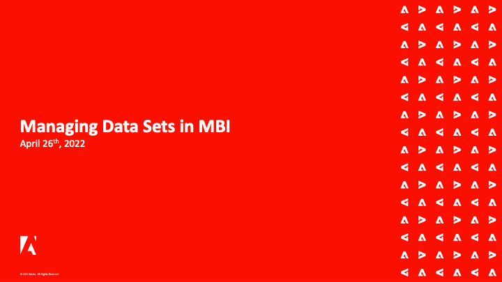

# Adobe Commerce Intelligence-Webinare

>[!NOTE]
>
>Adobe Commerce Intelligence wurde früher als [!DNL Magento Business Intelligence (MBI)]. Aufzeichnungen früherer Ereignisse spiegeln den vorherigen Namen wider.

Die Webinarreihe &quot;Commerce Intelligence&quot;ist ein periodisches Ereignis für Commerce Intelligence-Kunden. Die Webinare decken eine breite Palette von Themen und Best Practices für die Nutzung von Commerce Intelligence ab, um das bestmögliche Potenzial zu nutzen.

Teilnehmer aus allen Ländern können an den Veranstaltungen teilnehmen, um das Produkt besser zu verstehen und ihre Fragen zur Commerce Intelligence-Funktion direkt zu beantworten.

Die Themen werden gelegentlich wiederholt, um neue Fragen aufzugreifen, die von den Kunden gestellt werden können.

## Mitarbeiterauswahl

<table>
<tr>
  <td>
    
     

      <a href="https://experienceleague.adobe.com/docs/events/commerce-intelligence-webinar-recordings/2023/getting-started.html">
        <strong>Erste Schritte mit Commerce Intelligence</strong>
      </a>
    

    

    <em>Informieren Sie sich direkt vom Produktteam über die Kernfunktionen von Commerce Intelligence und lernen Sie die vorkonfigurierten Dashboards und die verfügbaren Anpassungsoptionen eingehend kennen.</em>
    

  </td>
  <td>
    
     

      <a href="https://experienceleague.adobe.com/docs/events/commerce-intelligence-webinar-recordings/2023/manage-data-sets.html">
        <strong>Verwalten von Datensätzen in MBI</strong>
      </a>
    

    

    <em>Erfahren Sie mehr über einige der leistungsstarken Funktionen des MBI-Data Warehouse-Managers direkt vom Adobe Commerce-Produktteam. Gehen Sie über die grundlegende Berichterstellung hinaus und lernen Sie, wie Sie mit Ihren Daten mehr erreichen können.</em>
    

  </td>
   <td>
    
     

      <a href="https://experienceleague.adobe.com/docs/events/commerce-intelligence-webinar-recordings/2021/optimize-data-warehouse.html">
        <strong>Optimieren Ihres MBI-Data Warehouse</strong>
      </a>
    

    

    <em>Mithilfe des Data Warehouse-Managers können Sie Einstellungen für die Tabellen- und Spaltensynchronisierung verwalten, einen Drilldown im Schema einer Tabelle durchführen und berechnete Spalten für die Verwendung in Berichten erstellen.</em>
    

  </td>
</tr>
</table>

>[!TIP]
>
>**Alle aufgezeichneten Webinare sind in der Navigation links aufgeführt**.

## Nützliche Ressourcen

- [Commerce Intelligence-Videos und -Tutorials](https://experienceleague.adobe.com/docs/commerce-learn/tutorials/mbi/filter-sets.html)
- [Benutzerhandbuch für Commerce Intelligence](https://experienceleague.adobe.com/docs/commerce-business-intelligence/mbi/guide-overview.html?lang=de)
