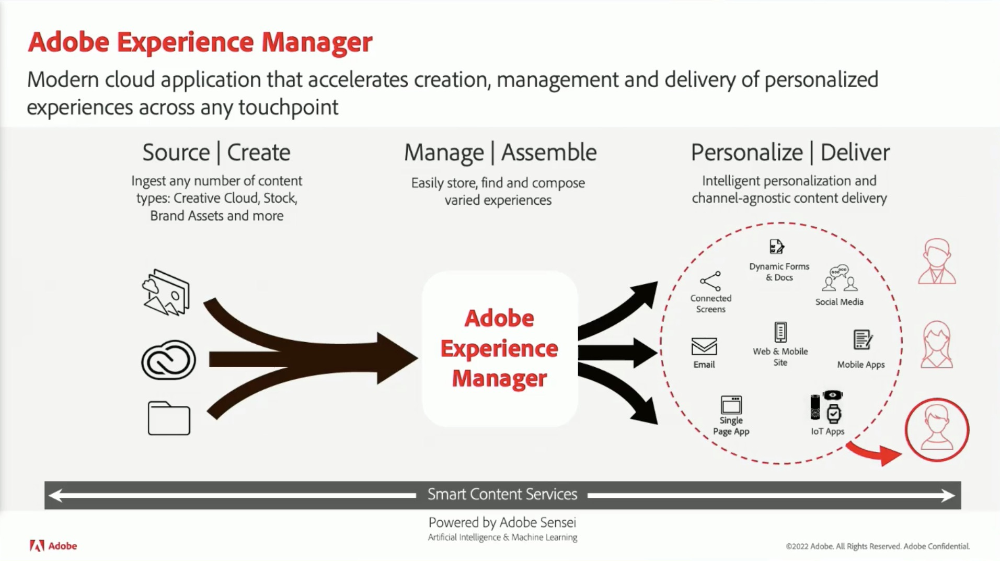

# Content und Commerce

Erstellen und verwalten Sie eine Reihe ansprechender Websites, mobiler Apps und Formulare. Darüber hinaus erfahren Sie, wie Sie mit unserer flexiblen, KI-gestützten Commerce-Lösung auf einer einzigen Plattform Commerce-Erlebnisse für mehrere Kanäle erstellen können.

## Neuerungen

<table>
<tr>
  <td>
    
     

      <a href="https://experienceleague.adobe.com/docs/skill-builder-events/skill-builder/content-and-commerce/2022/headless.html">
        <strong>Bereitstellen von Headless-Erlebnissen mit Adobe Experience Manager</strong>
      </a>
    

    

    <em>Erfahren Sie mehr über das Headless-Erlebnis-Management mit den neuesten Inhaltsfragment-Verbesserungen in Adobe Experience Manager und die neue GraphQL-API für Headless-Content-Bereitstellung.</em>
    

  </td>
  <td>
    
     

      <a href="https://experienceleague.adobe.com/docs/skill-builder-events/skill-builder/content-and-commerce/2022/metadata.html">
        <strong>Verwenden von Metadaten für Ihr Unternehmen in Adobe Experience Manager Assets</strong>
      </a>
    

    

    <em>Erfahren Sie, wie Sie Ihre Metadaten in AEM Assets optimal nutzen können, indem Sie den Arbeitsaufwand für das Tagging von Assets reduzieren und Ihre Assets durchsuchbarer gestalten.</em>
    

  </td>  
  <td>
    
     

      <a href="https://experienceleague.adobe.com/docs/skill-builder-events/skill-builder/content-and-commerce/2022/workflow.html">
        <strong>Enterprise Workflow Management optimal nutzen</strong>
      </a>
    

    

    <em>In dieser Sitzung erfahren Sie mehr über die Vorteile der Verwendung von Workflows für Ihre Asset-Verwaltung und darüber, wie Sie diese schnell erstellen.</em>
    

  </td>
</tr>
</table>

>[!TIP]
>
>**Alle aufgezeichneten Sitzungen werden in der Navigation auf der linken Seite aufgeführt**.
