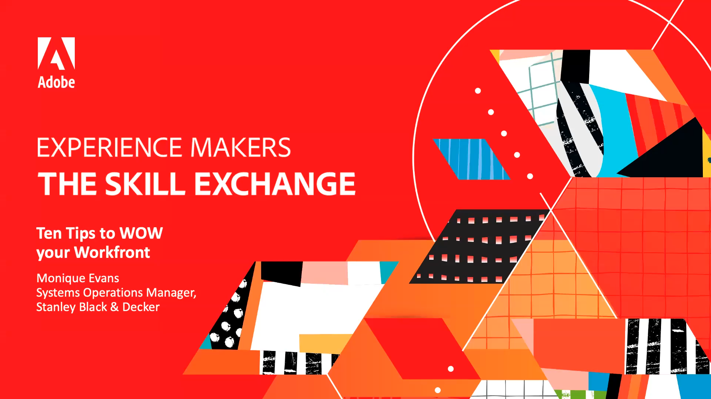

# Experience Makers The Skill Exchange {#overview}

Experience Makers The Skill Exchange ist eine globale Reihe virtueller Kundenschulungsveranstaltungen, die sich auf die Vertiefung von Adobe Experience Cloud-Lösungen konzentrieren. Dieses Programm bietet die Möglichkeit, durch den Austausch von Best Practices und Tipps und Tricks von Adobe-Produktexperten und Fachkollegen zu lernen.

>[!TIP]
>
>**Alle aufgezeichneten Sitzungen werden im Navigationsbereich auf der linken Seite**.

## Vorgestellte Sitzungen

<table>
  <tr>
   <td>
      
      

         <a href="analytics/jun2021/getting-started.md"><strong>Erste Schritte mit Adobe Analytics</strong></a>
<!---          <em>foo</em> -->
      

      

         
         Machen Sie sich mit der grundlegenden Analytics-Benutzeroberfläche vertraut und starten Sie Ihr erstes Projekt in Analysis Workspace.
      

    </td>
   <td>
      
      

         <a href="marketo/feb2022/data-maintenance.md"><strong>Datenpflege</strong></a>
<!---          <em>foo</em> -->
      

      

         
         Einfach angewandte Methoden, um Ihr wichtigstes Asset sauber zu halten.
      

    </td>
   <td>
      
      

         <a href="workfront/apr2022/ten-tips.md"><strong>10 Tipps, um Ihre Workfront zu begeistern</strong></a>
<!---          <em>foo</em> -->
      

      

         
         Diese Tipps richten sich an Administratoren, die sich schon seit einiger Zeit in ihrer Instanz befinden und auf eine effizientere Vorgehensweise hoffen.
      

    </td>
  </tr>
</table>
