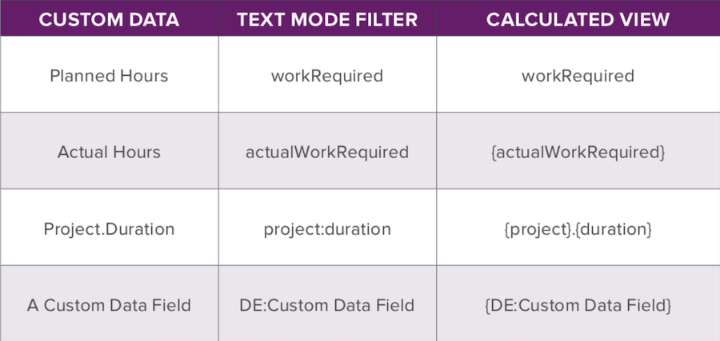

# Fragen an den Experten - Aufladen der grundlegenden Textmodusberichte mit dem API-Explorer

Erfahren Sie mehr über [[!UICONTROL API Explorer]](https://developer.adobe.com/workfront/api-explorer/), wie Sie ihn verwenden und Ihre Berichte mithilfe des einfachen Textmodus verbessern können. Dieses Webinar wurde am 22. Januar 2020 aufgezeichnet.

>[!VIDEO](https://video.tv.adobe.com/v/341124/?quality=12)

## Weitere Ressourcen




**Endgültige Spalte „Alle Aufgabengebiete“**

```
description="Primary =" indicates the user's primary job role
displayname=All Job Roles
listdelimiter=<p>
listmethod=nested(userRoles).lists
textmode=true
type=iterate
valueexpression=IF({user}.{roleID}={role}.{ID},CONCAT("Primary = ",{role}.{name}),{role}.{name})
valueformat=HTML
```

**Textmodus für die Spalte „Alle Teams“**

```
displayname=All Teams
listdelimiter=<p>
listmethod=nested(teams).lists
textmode=true
type=iterate
valueexpression={name}
valueformat=HTML
```

**Textmodus für die Spalte „Alle Gruppen“**

```
displayname=All Groups
listdelimiter=<p>
listmethod=nested(userGroups).lists
textmode=true
type=iterate
valuefield=group:name
valueformat=HTML
```

**Textmodus für die Spalte „Direktberichte“**

```
displayname=Direct Reports
listdelimiter=<p>
listmethod=nested(directReports).lists
textmode=true
type=iterate
valueexpression={name}
valueformat=HTML
```

## Fragen und Antworten

**Frage**

Ist es möglich, im Textmodus eine beliebige Sammlung in einem Bericht zu verwenden?

**Antwort**

Ja, Sie können jedes Objekt im Bereich „Sammlungen“ verwenden. Sie sollten erkunden und sehen, auf was Sie Zugriff haben. Nicht alles hat Zugriff auf das Benutzerobjekt und das Aufgabenrollenobjekt, wie wir beim Benutzerrollenobjekt im API-Explorer gesehen haben.

**Frage**

Können Sie über die „bedingte Verwendung verschiedener Sammlungen in derselben Spalte (Projektaktualisierungen vs. Aufgabenaktualisierungen)“ sprechen?

**Antwort**

Wenn Sie sich im Bereich „Iteration“ befinden und das Wertefeld oder den Wertausdruck dort sehen, bedeutet das, dass Sie auf eines der Elemente in Ihrer Sammlungsliste zugreifen. Mithilfe des Wertefelds können wir beispielsweise den Namen dieses Aufgabengebiets oder alles abrufen, was in diesem Element in der Liste enthalten ist. Wenn Sie sich in einer Aufgabe befinden, kann ein Aufgabenobjekt auf das Projekt verweisen, in dem es sich befindet.

**Frage**

Können Sie besprechen, ob die Sammlung „Aufgabenaktualisierungen“ nur in einem Aufgabenbericht möglich ist?

**Antwort**

Wenn Sie einen Problembericht erstellen, können Sie Aufgabeninformationen anzeigen, wenn das Problem für die Aufgabe gemeldet wurde. Diese Informationen können auch in der Sammlung angezeigt werden. Mit Ausnahme dieser Situationen müssten Sie sich in einem Aufgabenbericht befinden, um Aufgabenerfassungsdaten anzuzeigen.

**Frage**

Können Beispiele für Textformate ([!DNL CSS]) freigegeben werden?

**Antwort**

Workfront unterstützt [!DNL CSS] im Textmodus nicht.

**Frage**

Was ist die beste und/oder schnellste Möglichkeit, einen benutzerdefinierten Feldnamen zu finden - für Berichte im Textmodus? Ich habe die HTML-Bearbeitungsoption im Browser ODER durch Hinzufügen eines Felds in einem Bericht und Wechseln in den Textmodus verwendet, um es zu erfassen, ABER… neugierig, wie andere dies tun

**Antwort**

Ich finde es am schnellsten, das Feld in der Benutzeroberfläche auszuwählen, dann in den Textmodus zu wechseln und den Feldnamen zu kopieren. Dadurch wird sichergestellt, dass ich die richtige Schreibweise für das Feld erhalte.

**Frage**

Wie kann ich den Textmodus verwenden, um Mitglieder eines Teams in einem Bericht zu identifizieren? Wir verwenden derzeit Team-Zuweisungen in Aufgabengenehmigungs-Workflows und möchten die Team-Mitglieder in der aktuellen Genehmigungsphase in einer Spalte ähnlich der Spalte mit der Funktionsweise des Felds Genehmigende Person und Status auflisten.

**Antwort**

Um auf die Team-Mitglieder zu verweisen, die mit der aktuellen Genehmigungsphase verknüpft sind, müssen Sie auf eine Sammlung einer referenzierten Sammlung verweisen, was derzeit über die Textmodusfunktionen von Workfront nicht möglich ist. Die Spalte, die Ihre Organisation derzeit verwendet und die das mit der Genehmigung verknüpfte Team anzeigt, ist Ihre beste Option.

**Frage**

Müssen Feld- und Objektname in Kleinbuchstaben geschrieben werden (z. B. Funktion vs. Funktion)?

**Antwort**

Wenn Sie auf Objekte im Textmodus verweisen, sollten Sie sie genau so schreiben, wie es die rechte Spalte des API-Explorers zeigt. Wenn Sie beispielsweise in einem Aufgabenbericht auf einen Projektnamen verweisen möchten, würde Ihr Wertefeld wie folgt aussehen:

```
valuefield=project:name
```

Bei Problemen werden diese jedoch im API-Explorer als opTasks bezeichnet. Wenn Sie also einen Stundenbericht ausführen und eine Spalte für den Problemnamen hinzufügen möchten, würde das Wertfeld
sieht wie folgt aus:

```
valuefield=opTask:name
```

**Frage**

Ich suche einen Bericht, der für jedes Projekt die aktuell bearbeiteten aktiven Aufgaben anzeigt. Wie sollte ich das am besten tun? Ich stelle mir vor, dass es sich um einen Aufgabenbericht handelt, dem auch Spalten mit Projektinformationen hinzugefügt wurden?

**Antwort**

Das ist richtig. Ein Aufgabenbericht ist dafür am besten geeignet. Sie müssen „Aktive Aufgaben“ definieren. Wenn Sie Vorgänger verwenden, wären dies Aufgaben, die bereit sind. So können Sie nach Bereit = True filtern. Dadurch würden alle Aufgaben eingehen, die startbereit sind. Dann empfehle ich Ihnen, nach Projektname zu gruppieren. Auf diese Weise werden Ihre Aufgaben alle gruppiert und Sie können auf einen Blick sehen, welche Aufgaben zu welchem Projekt gehören.

**Frage**

Gibt es eine Möglichkeit, Berichte zu erstellen, die Daten berechnen - z. B. % der Projekte, die bestimmte Kriterien erfüllen?

**Antwort**

Die beste Möglichkeit, einen Bericht zu erstellen, um Daten darzustellen oder zu berechnen (z. B. %), besteht darin, Gruppierungen auf Ihren Bericht anzuwenden und dann ein Diagramm anzuwenden. Wenn Sie Ihrem Bericht ein Tortendiagramm hinzufügen, haben Sie die Möglichkeit, die Tortenscheiben in Werten oder Prozentsätzen anzugeben.

**Frage**

Können Sie den Textmodus verwenden, um die Mitglieder eines Teams zu identifizieren, die der aktuellen Aufgabengenehmigungsphase ähnlich der Spalte Genehmigende Person und Status zugewiesen sind?

**Antwort**

Dazu müssten Sie Ihrem Aufgabenbericht im Textmodus eine Sammlungsspalte mit folgendem Inhalt hinzufügen:

```
displayname=Current Approval Stage Approvers 
listdelimiter=<p> 
listmethod=nested(currentApprovalStep.stepApprovers).lists 
textmode=true
type=iterate 
valuefield=user:name 
valueformat=HTML
```

**Frage**

Können Sie filtern, wo eine bestimmte Gruppe in allen Gruppen enthalten ist?

**Antwort**

Wenn Sie die Elemente in Ihrem Bericht filtern möchten, müssen Sie dies auf der Registerkarte Filter Ihres Berichts tun. Wenn Sie also nur Benutzer sehen möchten, deren Gruppe die Kontoführung ist, fügen Sie eine Filterregel hinzu, die Folgendes enthält:

```
Other Groups>ID>Equal>Accounting
```

**Frage**

Gibt es eine Möglichkeit, einen Bericht zu erstellen, der die tatsächliche Dauer einer Kombination von Aufgaben bestimmt?

**Antwort**

Sie müssen Ihren Bericht so filtern, dass er nur die gewünschte Aufgabenkombination enthält. Anschließend müssen Sie die Spalte Tatsächliche Dauer in Ihre Ansicht einfügen und sie in den Spalteneinstellungen nach Summe zusammenfassen. Schließlich müssen Sie Ihren Bericht auf irgendeine Weise gruppieren. Wenn Sie den Bericht ausführen, zeigt die Gruppierungsleiste die Gesamtdauer an, die in den gruppierten Zeilen tatsächlich enthalten sind.

**Frage**

Gibt es eine Möglichkeit, Aufgaben, die unter ein übergeordnetes Element fallen, abzuziehen, um die Dauer für den Rest der Aufgaben unter einem übergeordneten Element zu bestimmen?

**Antwort**

Die Dauer einer übergeordneten Aufgabe wird berechnet, indem das Startdatum der frühesten Startaufgabe vom Enddatum der letzten Endaufgabe unter dieser übergeordneten Aufgabe abgezogen wird. In einem Bericht wissen Sie nur über jede einzelne Aufgabe, die in Betracht kommt, ob sie angezeigt werden soll oder nicht. Die Report Engine hat keine Möglichkeit, Informationen aus einer Aufgabe beizubehalten und sie beim Betrachten einer anderen Aufgabe zu verwenden. Die einzige Möglichkeit, Ihre Anforderung zu erfüllen, besteht darin, eine Aufgabe aus der Unterzugehörigkeit zu einer übergeordneten Aufgabe zu entfernen, während sie sich in der Projektaufgabenliste befindet, und zu beobachten, wie die Dauer der übergeordneten Aufgabe neu berechnet wird.

**Frage**

Für bedingte Gruppierungen ist eine benutzerdefinierte Form (denken Sie an „westliche Staaten“, „zentrale Staaten“, „östliche Staaten„) zum Decodieren der einzelnen Gruppen eine gängige Technik, die gut auf diese Anmerkung funktioniert. Wann empfehlen Sie die Verwendung berechneter Gruppierungen vs. berechneter Parameter?

**Antwort**

Berechnete Gruppierungen (auch als Werteausdruck in einer Gruppierung bezeichnet) sind eine praktische Methode, um ein Ergebnis in Ihrer Gruppierungsleiste anzuzeigen. Dies kann auch mit einem berechneten benutzerdefinierten Feld erfolgen. Es gibt Vor- und Nachteile für jeden Ansatz, die:

* Wertausdrücke werden jedes Mal berechnet, wenn Ihre Browser-Seite aktualisiert wird. Dies kann besser sein als berechnete benutzerdefinierte Felder, die neu berechnet werden, wenn das Objekt, mit dem sie verknüpft sind, bearbeitet wird oder wenn die berechneten Felder in einer Massenbearbeitung neu berechnet werden oder wenn das benutzerdefinierte Formular bearbeitet wird und die Option „Vorherige Berechnungen aktualisieren“ ausgewählt ist.
* Wertausdrücke können jedoch nicht in Diagrammen, bedingter Formatierung oder Filtern verwendet werden. Sie müssen hierfür berechnete benutzerdefinierte Felder verwenden.

**Frage**

Gibt es keine Möglichkeit, den Anzeigenamen der Gruppierung von „Kein Wert“ in etwas Anderes zu ändern, das wir zu Berichtszwecken als Gruppierung bezeichnen? Mit anderen Worten, es wird IMMER „kein Wert“ sein?

**Antwort**

Es gibt eine Möglichkeit, „Kein Wert“ durch etwas Anderes zu ersetzen. Angenommen, Sie haben einen nach Portfolio-Namen gruppierten Projektbericht. Alle Projekte, die keinem Portfolio zugewiesen sind, werden in einer Gruppierung mit dem Titel landen:

```
Portfolio: Name: No Value
```

Um dies zu ändern, bearbeiten Sie die Gruppierung im Textmodus und ersetzen Sie diese Zeile:

```
group.0.valuefield=portfolio:name
```

mit dieser Zeile:

```
group.0.valueexpression=IF(ISBLANK({portfolio}.{name}),"Not in any Portfolio",{portfolio}.{name})
```

Die Gruppierung hat jetzt diesen Titel:

```
Portfolio: Name: Not in any Portfolio
```

**Frage**

Gibt es einen Parameter zum Nachverfolgen unvollständiger Zuweisungen, d. h.:

1. Aufgaben mit einer einzelnen Zuweisung, denen keine Einzelperson zugewiesen wurde, oder
1. Aufgaben mit mehreren Zuweisungen, denen mindestens eine nicht zugewiesene Person für die angeforderten Rollen zugewiesen ist

**Antwort**

Dies lässt sich durch die Verwendung eines Arbeitsauftragsberichts und die Filterung nach Folgendem erreichen

```
Assigned To ID > Is Blank and Role ID > Is Not Blank
```

Dadurch werden alle Aufgaben oder Probleme abgerufen, die einer Rolle, aber nicht notwendigerweise einem bestimmten Benutzer zugewiesen wurden. Sie müssen die Spalten für Aufgaben- und Problemname hinzufügen, um zu sehen, zu welchem Objekt die Zuweisung gehört, und wenn sie nach Projektname gruppiert sind, sollte sie helfen, sie organisiert zu halten.

**Frage**

Chuck, ich vergesse, aber erinnern Sie sich an die Eigenschaft im Textmodus, die dann beim Bewegen des Mauszeigers als QuickInfo gerendert wird?

**Antwort**

description= Ermöglicht es Ihnen, eine QuickInfo anzuzeigen, wenn Sie den Mauszeiger über die Spaltenüberschrift bewegen.

**Frage**

Kann ich einen Bericht zu einem Kontrollkästchen erstellen, das mehrere Auswahlmöglichkeiten zulässt, aber nur die erste Auswahl in den Bericht zieht?

**Antwort**

Ja. Die ausgewählten Auswahlmöglichkeiten im Kontrollkästchen befinden sich alle in einer Zeichenfolge, wobei jede Auswahl durch ein Komma getrennt ist. Verwenden Sie den Suchausdruck, um die Position des ersten Kommas im Kontrollkästchenfeld zu finden, und verwenden Sie dann diesen Index mit dem LINKEN Ausdruck, um so viele Zeichen vom Anfang der Liste anzuzeigen. Hier ist der Code:

```
valueexpression=IF(SEARCH(",",{DE:Checkbox Field},0)>0,LEFT({DE:Checkbox Field},SEARCH(",",{DE:Checkbox Field},0)),{DE:Checkbox Field})
```

Wenn Sie in einem Auswahlfeld ein Komma verwenden, wird nur der Teil der Auswahl bis zum ersten Komma angezeigt.
